# Tech Study Tracker

App personal para organizar las tecnologías que estoy estudiando: un
índice por categorías y un dashboard con el estado de cada una
(pendiente / en progreso / completado). Especificación completa en
[`specs/spec.md`](specs/spec.md), plan técnico en
[`specs/plan.md`](specs/plan.md).

## Stack

- **Frontend:** React + TypeScript + Vite + Tailwind CSS v4 + shadcn/ui
- **Backend:** Supabase (Postgres + Auth) — sin servidor propio; Supabase
  expone una API REST autogenerada sobre cada tabla, y toda la
  autorización la hace Postgres vía Row Level Security (RLS), no código
  nuestro
- **Testing:** Vitest + React Testing Library + vitest-axe
- **Despliegue:** Vercel (frontend) + Supabase (datos), en sitios
  distintos, cada uno gestionado por su dueño

## Cómo se desarrolla: Claude Code + Codex

Este proyecto se construye con dos agentes de IA en roles distintos, no
intercambiables:

- **Claude Code** planifica, revisa, decide arquitectura, gestiona git
  (ramas/commits/PRs/merges), corre los scanners de seguridad, y verifica
  de forma independiente lo que Codex dice haber hecho — nunca se da por
  buena la palabra de un agente sin comprobarlo (tests corridos de
  verdad, build real, a veces incluso una prueba end-to-end en
  navegador contra el Supabase real).
- **Codex** implementa código dentro de una rama ya creada, sobre
  instrucciones concretas de una sola feature a la vez.

**Restricción real, no teórica:** el sandbox de Codex (`workspace-write`)
no permite tocar `.git` en absoluto — ni `checkout -b`, ni `add`, ni
`commit`, ni `push` — y tampoco tiene acceso a red (no puede hacer
`npm install` ni hablar con Supabase). Por eso Codex nunca crea ramas ni
hace commits: implementa sobre el working tree, corre sus propios tests
localmente, y dice explícitamente qué hizo; Claude Code es quien crea la
rama, mueve los cambios ahí, verifica todo otra vez de forma
independiente, comitea, hace push y abre el PR. Está documentado con
más detalle en [`AGENTS.md`](AGENTS.md).

### De un vistazo: cómo se orquesta una feature completa

```mermaid
flowchart TD
    A["Usuario pide una feature"] --> B["Claude: brainstorming + spec<br/>specs/features/&lt;feature&gt;.md"]
    B --> C["Claude: rama feat/&lt;nombre&gt; desde main<br/>(nunca se implementa sobre main)"]
    C --> D["Claude: plan de implementación"]
    D --> E["Se delega en Codex:<br/>script codex-task.sh (prompt, effort)<br/>+ panel codex-monitor en localhost:4545"]
    E --> F["Codex implementa en el working tree<br/>sandbox workspace-write: sin red, sin tocar .git"]
    F --> G["Codex prueba y compila por su cuenta<br/>y reporta qué hizo (y qué NO pudo hacer)"]
    G --> H["Claude revisa el diff de verdad<br/>nunca se da por buena la palabra de Codex"]
    H -->|insuficiente| E
    H -->|ok| I["Verificación local obligatoria:<br/>tests, build y lint del proyecto<br/>⚠️ el CI de este repo NO los verifica, solo seguridad"]
    I --> J{"¿Toca RLS, auth o datos sensibles?"}
    J -->|sí| K["Migración manual en Supabase SQL Editor<br/>(Codex y el sandbox no tienen red)"]
    K --> L["Verificación real contra Supabase<br/>anónimo / registrado / admin, peticiones HTTP directas"]
    J -->|no| M
    L --> M["Claude: revisión de seguridad<br/>/security-review (8 dominios) o fallback secuencial<br/>guardada en security/reviews/"]
    M --> N["Claude: commit + push + PR contra main"]
    N --> O["CI (security-scan.yml):<br/>solo los 5 scanners bash de scripts/security/"]
    O -->|rojo| H
    O -->|verde y revisado| P["Merge a main<br/>solo con confirmación explícita del usuario"]
```



**Lo que este diagrama deja explícito y que antes solo estaba en
prosa repartida:** el CI de este repo **no** corre `test`/`build`/`lint`
— eso es responsabilidad de Claude en local, cada vez, antes de dar una
rama por terminada. Y el sandbox `workspace-write` de Codex está
confinado al repo en el que se lanza *en teoría*, pero en la práctica
depende del `trust_level` configurado en `~/.codex/config.toml` del
usuario — no asumir aislamiento total entre proyectos solo por el
nombre del sandbox.

### Flujo de ramas

Ninguna feature se comitea directo a `main`:

1. Rama `feat/<nombre>` (o `fix/<nombre>`) desde `main` actualizado —
   una rama por feature, no varias mezcladas.
2. Implementación + `npm run test && npm run build && npm run lint`
   en verde **en local** — el CI no los corre (ver diagrama arriba).
3. Push + PR contra `main`. El workflow de GitHub Actions
   (`.github/workflows/security-scan.yml`) corre automáticamente en
   cada PR, pero solo los scanners de seguridad de `scripts/security/`.
4. Merge solo cuando CI está en verde y el PR ha sido revisado.

## Los agentes de seguridad

En vez de una única pasada de seguridad genérica, hay **8 checklists de
dominio** en [`.claude/agents/`](.claude/agents/), cada uno enfocado en
un área concreta: entorno del propio agente IA, secretos/claves,
vulnerabilidades de código, cadena de suministro (dependencias),
inyección (XSS, URLs), auth/RLS, infraestructura de despliegue, y
prompt-injection (instrucciones ocultas dirigidas a agentes IA).

- **`/security-review`** (Claude Code) orquesta los 8 en paralelo,
  sintetiza un informe único con severidad y risk score, y lo guarda en
  [`security/reviews/`](security/reviews/) — no se queda solo en el
  chat, para que quede versionado y buscable.
- **`scripts/security/*.sh`** son los scanners automáticos (bash puro,
  sin dependencias de Claude Code) que cada subagente corre como primer
  paso: secretos hardcodeados, patrones de código vulnerable,
  dependencias sin pinnear, config insegura, prompt-injection. Los usa
  también un **hook de pre-commit** local (bloquea el commit si hay
  hallazgos CRITICAL/HIGH de secretos) y el **CI** (bloquea el merge del
  PR con el mismo criterio).
- **Codex** no tiene el mecanismo de subagentes de Claude Code, así que
  sigue la misma auditoría de forma secuencial, leyendo cada checklist
  como si fuera texto plano — instrucciones exactas en `AGENTS.md`.
- [`security/security-review-instructions.md`](security/security-review-instructions.md)
  documenta los precedentes específicos de este proyecto (por qué RLS es
  la capa de autorización real, cómo se sanea `notes`/`resources`, etc.)
  para que los scanners no generen falsos positivos sobre decisiones ya
  tomadas.

## Tipos de test

Hay varias capas, cada una comprueba algo distinto:

| Capa | Herramienta | Qué prueba | ¿Toca red/Supabase real? |
|---|---|---|---|
| Unitarios | Vitest | Funciones puras (`groupByCategory`, `computeStats`, `validateResourceUrl`) | No |
| Componentes | Vitest + Testing Library | Formularios/páginas renderizadas de verdad en DOM simulado, interacción incluida | No — Supabase mockeado |
| Accesibilidad | vitest-axe | Auditoría axe-core sobre el DOM renderizado (labels, contraste, aria) | No |
| Hooks | Testing Library (`renderHook`) | `useAuth` aislado, `supabase.auth` mockeado | No |
| Lint | ESLint + jsx-a11y | Patrones incorrectos sin ejecutar nada | No |
| Type-check | `tsc` (parte de `npm run build`) | Tipos en tiempo de compilación | No |
| Seguridad | `scripts/security/*.sh` + subagentes | Secretos, inyección, RLS, dependencias | No |
| End-to-end | Playwright (manual, no en CI) | La app real, en un navegador real, contra el Supabase real — la única capa sin mocks | **Sí** |

Las siete primeras corren automáticamente en cada PR
(`npm run test && npm run build && npm run lint` + los scanners de
seguridad). La última se hace a mano cuando hay algo importante que
verificar de extremo a extremo — no está automatizada porque
necesitaría credenciales reales en CI y consumiría cuota real de
Supabase (emails, rate limits) en cada push.

### Enfoque de tests: cobertura obligatoria, no TDD estricto

Ninguna rama se da por terminada sin tests que la cubran, y el CI
bloquea cualquier PR que no los tenga en verde — esa es la regla dura,
la misma que persigue TDD. Pero **no es TDD estricto** en el sentido de
"escribir el test en rojo antes que una sola línea de implementación":
Codex implementa la funcionalidad y sus tests como parte del mismo paso,
no en dos fases separadas. Si en algún momento se pide TDD estricto para
una feature concreta, hay que decirlo explícitamente en el prompt —
por defecto no es lo que se sigue.

## Cómo levantar el proyecto en local

```bash
npm install
cp .env.example .env   # y rellena VITE_SUPABASE_URL / VITE_SUPABASE_ANON_KEY
npm run dev            # servidor de desarrollo
npm run test            # tests
npm run build           # build de producción + type-check
npm run lint             # ESLint
```

La `anon key` de Supabase es pública por diseño (protegida por RLS) y sí
se puede tener en `.env` local — la `service_role key` nunca debe
aparecer en este proyecto, ver
[`security/security-review-instructions.md`](security/security-review-instructions.md).

## Ver a Codex trabajar en vivo

`codex exec` por defecto no imprime nada hasta que termina — para una
tarea de varios minutos, eso es no tener ninguna visibilidad de qué está
pasando. `scripts/dev/` da dos herramientas para lanzar tareas de Codex
con streaming en tiempo real, en vez de tener que esperar a ciegas:

```bash
# Terminal 1: lanza la tarea (queda logueada en .codex-logs/, gitignored)
npm run codex:task -- "Implementa X en src/lib/utils, con tests" low

# Terminal 2: panel en vivo — se abre solo en http://localhost:4545,
# auto-detecta el log más reciente si no le pasas uno
npm run codex:monitor
```

`codex:task` acepta `[reasoning_effort] [model]` como segundo y tercer
argumento (por defecto `medium`, sin modelo explícito = el default de
Codex) — usa `low` para tareas mecánicas/bien acotadas y `high` para
algo ambiguo o sensible a seguridad, en vez de dejarlo siempre en
default (ver `AGENTS.md`).


**Por qué existen estos scripts y no solo `codex exec "..."` a pelo:**
lanzar `codex exec` en segundo plano sin cerrar `stdin` puede dejarlo
colgado indefinidamente esperando un EOF que nunca llega — pasó de
verdad durante el desarrollo de este proyecto (~30 minutos perdidos
hasta diagnosticarlo). `codex-task.sh` ya incluye `< /dev/null` y
`--json` (necesario para que haya algo que el monitor pueda ir leyendo
en caliente) para que nadie tenga que volver a pisar esa misma piedra.

## Estructura

```
tech-study-tracker/
├── src/                    # app React
├── supabase/migrations/    # esquema SQL + RLS, versionado
├── specs/                  # spec funcional + plan técnico
├── security/               # checklist de precedentes + historial de revisiones
├── scripts/security/       # scanners bash
├── .claude/agents/         # los 8 checklists de dominio (subagentes)
├── .claude/commands/       # /security-review
├── .agents/skills/         # skills de terceros instaladas (ej. Supabase RLS/Postgres)
├── AGENTS.md                # instrucciones para cualquier agente (Codex incluido)
└── CLAUDE.md                 # instrucciones específicas de Claude Code
```
